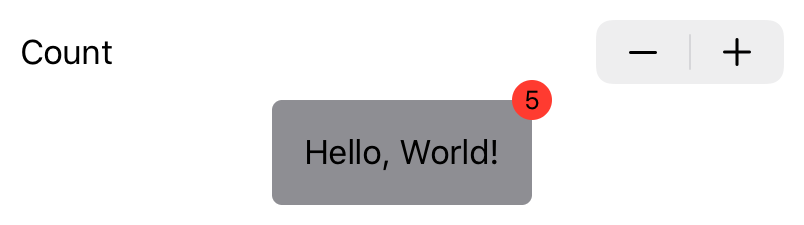

# Challenge 1: Badge View

In this challenge, we'll add a badge view. When `count` is not zero, it should display a badge in the top trailing corner, like so:



Here's the starting point:

```swift
import SwiftUI

extension View {
    func badge(count: Int = 0) -> some View {
        self  // todo
    }
}

struct ContentView: View {
    @State var counter = 0
    var body: some View {
        VStack {
            Stepper(onIncrement: {
                self.counter += 1
            }, onDecrement: {
                self.counter -= 1
            }, label: { Text("Count")})
            Text("Hello, World!")
                .padding()
                .background(
                    RoundedRectangle(cornerRadius: 5)
                        .fill(Color.gray))
                .badge(count: counter)
        }.padding()
    }
}

struct ContentView_Previews: PreviewProvider {
    static var previews: some View {
        ContentView()
    }
}

```
