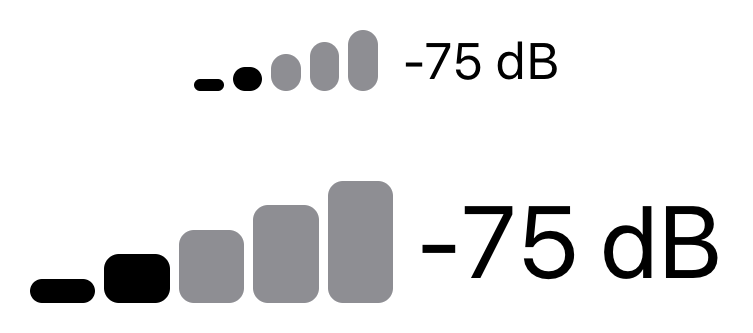

# Challenge 2: Signal Strength Indicator

Your task is to create a `SignalStrengthIndicator` view that has a flexible width and height: its contents should adapt to the given frame. Here's a sample of the view in action:

```swift
struct ContentView: View {
    var body: some View {
        SignalStrengthIndicator(bars: 2, totalBars: 5)
            .frame(width: 70, height: 30)
    }
}
```

It should look like this:


You should implement this without using a `GeometryReader`!

For a bonus challenge, create a `SignalStrengthView` that includes a text label. Make sure that the indicator scales with the environment's current font size. For example, here's the signal strength with and without a large title font:

```swift
struct ContentView: View {
    var body: some View {
        VStack(spacing: 30) {
            SignalStrengthView()
            SignalStrengthView()
                .font(.largeTitle)
        }
    }
}
```



