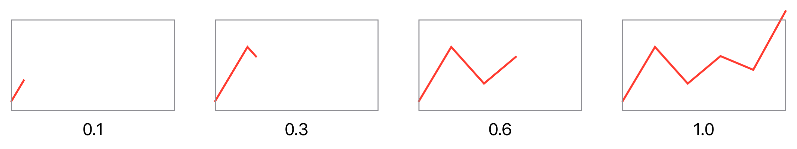

# Challenge 6: Animating a Line Graph

In this challenge, your task is to [draw and animate a line graph](https://twitter.com/objcio/status/1237755659610775554). Here's the line graph at different stages of the animation:



Here's a starting point for the code:

```swift
let sampleData: [CGFloat] = [0.1, 0.7, 0.3, 0.6, 0.45, 1.1]

struct LineGraph: Shape {
    var dataPoints: [CGFloat]
 
    func path(in rect: CGRect) -> Path {
        // ...
    }
}

struct ContentView: View {
    @State var on = true
    
    var body: some View {
        VStack {
            LineGraph(dataPoints: sampleData)
                .stroke(Color.red, lineWidth: 2)
                .aspectRatio(16/9, contentMode: .fit)
                .border(Color.gray, width: 1)
                .padding()
            Button(action: {
                withAnimation(Animation.easeInOut(duration: 2)) {
                    self.on.toggle()
                }
            }) { Text("Animate") }
        }
    }
}
```
